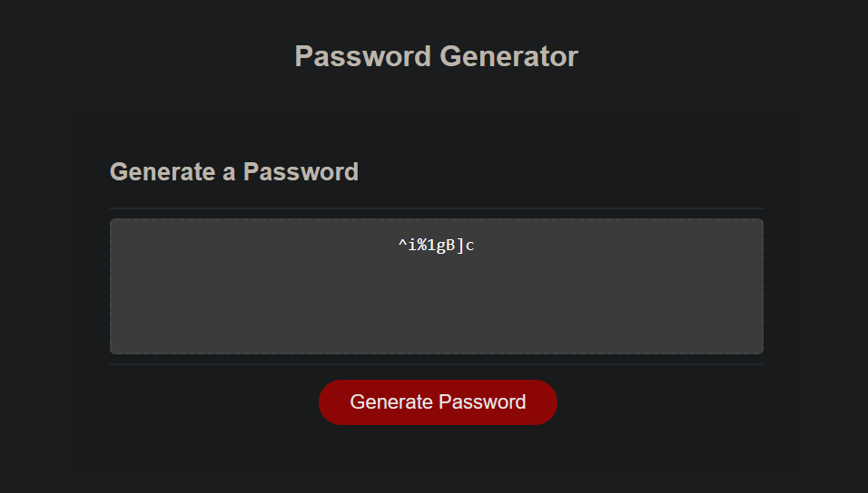

# Password-Generator

## Description 

An app that interacts with user to determine password quality requirements and then automatically generates a password to meet the user's requirements as provided via the dialog box.

The URL for the application is: https://046159.github.io/Password-Generator/

Below is a screenshot of the completed application:

## Usage 

* Launch the website.
* Follow the on-screen prompts.

## Credits

The following websites provided valuable input into this challenge:

* https://www.w3schools.com

## License

Please refer to Github for the information on licensing.

## Tests

1. Validate that password length is between 8 and 128 characters.
2. Validate that user has selected at least one of the options from lowercase, uppercase, numeric, and special characters.
3. Validate that the suggested password meets the requirements as chosen by the user.
---
